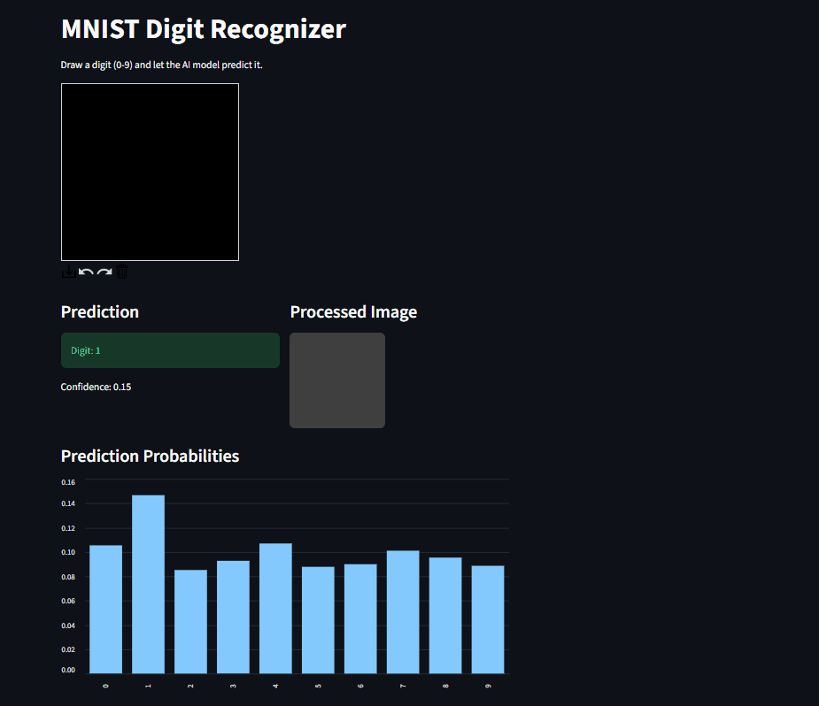

# MNIST Digit Recognizer

An interactive web application that recognizes **handwritten digits** using a Deep Learning model trained on the **MNIST dataset**.

Users can **draw a digit directly in the browser**, and the AI model predicts the digit in real time.

The project demonstrates the full Machine Learning workflow including **model training, preprocessing, deployment, and user interaction**.

---

# Live Demo

Streamlit App:

```
https://your-streamlit-app-link.streamlit.app
```

---

# Features

1-Draw digits directly in the browser
2-Real-time AI predictions
3-Probability distribution for each digit (0–9)
4-Image preprocessing pipeline
5-Interactive UI using Streamlit
6-Lightweight and fast inference

---

# Model

The model is a **Convolutional Neural Network (CNN)** trained on the **MNIST dataset**.

Dataset details:

* 60,000 training images
* 10,000 testing images
* Image size: **28 × 28 grayscale**

Example architecture:

```
Conv2D
MaxPooling
Conv2D
MaxPooling
Flatten
Dense
Dense (Softmax)
```

The final layer outputs probabilities for digits **0–9**.

---

# Tech Stack

* **Python**
* **TensorFlow / Keras**
* **Streamlit**
* **NumPy**
* **Pillow**
* **Streamlit Drawable Canvas**

---

# Project Structure

```
mnist-digit-recognizer
│
├── app.py
├── model.h5
├── requirements.txt
├── README.md
└── images
    └── demo.png
```

---

# Installation

Clone the repository

```
git clone https://github.com/AhmedKamel200058/MNIST.git
```

Move into the project directory

```
cd MNIST
```

Install dependencies

```
pip install -r requirements.txt
```

Run the application

```
streamlit run app.py
```

The app will open in your browser at:

```
http://localhost:8501
```

---

# Example Output

After drawing a digit:

* The model predicts the digit
* Displays the **confidence score**
* Shows a **probability chart** for all digits

Example:

```
Prediction: 7
Confidence: 98%
```

---

# Demo

You can add a GIF demo here.

```

```


---

# Author

**Ahmed Mohamed Kamel**

AI Engineer | Machine Learning | Computer Vision

GitHub:
https://github.com/AhmedKamel200058

LinkedIn:
https://www.linkedin.com/in/ahmed-kamel-089447252/
